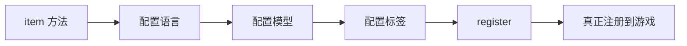

# RegistryLib 文档重构实现计划

> **For agentic workers:** REQUIRED SUB-SKILL: Use superpowers:subagent-driven-development (recommended) or superpowers:executing-plans to implement this plan task-by-task. Steps use checkbox (`- [ ]`) syntax for tracking.

**Goal:** 将 RegistryLib 文档从 Jekyll 迁移到 Docusaurus，实现友好亲切的设计风格和三层学习路径。

**Architecture:** 在项目根目录创建 `website/` 目录存放 Docusaurus 站点，配置自定义主题支持暗色/亮色模式，创建自定义 Admonition 组件，按 Diátaxis 框架重组内容。

**Tech Stack:** Docusaurus 3.x, React 18.x, Node.js 18+, GitHub Pages

---

## Phase 1: 项目初始化

### Task 1: 初始化 Docusaurus 项目

**Files:**
- Create: `website/` 目录及所有初始化文件

- [ ] **Step 1: 检查 Node.js 版本**

Run: `node --version`
Expected: v18.x.x 或更高

- [ ] **Step 2: 初始化 Docusaurus 项目**

Run: `cd d:/vscodeProject/RegistryLib3 && npx create-docusaurus@latest website classic --javascript`

Expected: 创建 `website/` 目录，包含基础 Docusaurus 结构

- [ ] **Step 3: 验证项目可启动**

Run: `cd d:/vscodeProject/RegistryLib3/website && npm start`
Expected: 浏览器自动打开 http://localhost:3000 显示 Docusaurus 欢迎页

- [ ] **Step 4: 停止开发服务器**

按 Ctrl+C 停止服务器

- [ ] **Step 5: 提交初始化**

```bash
cd d:/vscodeProject/RegistryLib3
git add website/
git commit -m "feat(docs): initialize Docusaurus website

Co-Authored-By: Claude Opus 4.6 <noreply@anthropic.com>"
```

---

### Task 2: 配置 docusaurus.config.js

**Files:**
- Modify: `website/docusaurus.config.js`

- [ ] **Step 1: 更新站点配置**

替换 `website/docusaurus.config.js` 内容为：

```javascript
// @ts-check
const lightCodeTheme = require('prism-react-renderer/themes/github');
const darkCodeTheme = require('prism-react-renderer/themes/dracula');

/** @type {import('@docusaurus/types').Config} */
const config = {
  title: 'RegistryLib',
  tagline: '流畅注册，一个链式调用搞定',
  favicon: 'img/favicon.ico',

  url: 'https://gregtech-odyssey.github.io',
  baseUrl: '/RegistryLib/',

  organizationName: 'GregTech-Odyssey',
  projectName: 'RegistryLib',
  trailingSlash: false,

  onBrokenLinks: 'throw',
  onBrokenMarkdownLinks: 'warn',

  i18n: {
    defaultLocale: 'en',
    locales: ['en'],
  },

  presets: [
    [
      'classic',
      /** @type {import('@docusaurus/preset-classic').Options} */
      ({
        docs: {
          path: '../docs-content',
          routeBasePath: '/',
          sidebarPath: require.resolve('./sidebars.js'),
          editUrl: 'https://github.com/GregTech-Odyssey/RegistryLib/tree/main/website/',
        },
        blog: false,
        theme: {
          customCss: require.resolve('./src/css/custom.css'),
        },
      }),
    ],
  ],

  themeConfig:
    /** @type {import('@docusaurus/preset-classic').ThemeConfig} */
    ({
      docs: {
        sidebar: {
          hideable: true,
          autoCollapseCategories: true,
        },
      },
      navbar: {
        title: 'RegistryLib',
        logo: {
          alt: 'RegistryLib Logo',
          src: 'img/logo.svg',
        },
        items: [
          {
            type: 'docSidebar',
            sidebarId: 'tutorialSidebar',
            position: 'left',
            label: '📚 教程',
          },
          {
            to: '/how-to/',
            label: '📖 指南',
            position: 'left',
          },
          {
            to: '/reference/',
            label: '📋 参考',
            position: 'left',
          },
          {
            to: '/concepts/',
            label: '💡 概念',
            position: 'left',
          },
          {
            href: 'https://github.com/GregTech-Odyssey/RegistryLib',
            label: 'GitHub',
            position: 'right',
          },
        ],
      },
      footer: {
        style: 'dark',
        links: [
          {
            title: '学习',
            items: [
              { label: '新手入门', to: '/tutorials/beginner/01-installation' },
              { label: '进阶教程', to: '/tutorials/intermediate/01-group-system' },
            ],
          },
          {
            title: '资源',
            items: [
              { label: 'API 参考', to: '/reference/api-quick-reference' },
              { label: 'GitHub', href: 'https://github.com/GregTech-Odyssey/RegistryLib' },
            ],
          },
        ],
        copyright: `Copyright © ${new Date().getFullYear()} GregTech Odyssey. Built with Docusaurus.`,
      },
      prism: {
        theme: lightCodeTheme,
        darkTheme: darkCodeTheme,
        additionalLanguages: ['java', 'groovy', 'gradle'],
      },
      algolia: {
        appId: 'YOUR_APP_ID',
        apiKey: 'YOUR_API_KEY',
        indexName: 'registrylib',
        contextualSearch: true,
      },
    }),
  plugins: [
    [
      '@docusaurus/plugin-client-redirects',
      {
        redirects: [
          { from: '/quickstart/', to: '/tutorials/beginner/01-installation' },
          { from: '/register-items/', to: '/how-to/register-items' },
          { from: '/register-blocks/', to: '/how-to/register-blocks' },
          { from: '/register-fluids-and-buckets/', to: '/how-to/register-fluids' },
          { from: '/register-advancements/', to: '/how-to/register-advancements' },
          { from: '/group-system/', to: '/tutorials/intermediate/01-group-system' },
          { from: '/tooltip-system/', to: '/tutorials/intermediate/02-tooltip-system' },
          { from: '/lang-system/', to: '/tutorials/intermediate/03-multi-language' },
          { from: '/api-reference/', to: '/reference/api-quick-reference' },
          { from: '/override-builders/', to: '/tutorials/expert/01-custom-builder' },
        ],
      },
    ],
  ],
};

module.exports = config;
```

- [ ] **Step 2: 验证配置**

Run: `cd d:/vscodeProject/RegistryLib3/website && npm start`
Expected: 无配置错误，站点正常启动

- [ ] **Step 3: 提交配置**

```bash
cd d:/vscodeProject/RegistryLib3
git add website/docusaurus.config.js
git commit -m "feat(docs): configure Docusaurus with custom settings

- Set up site metadata and GitHub Pages deployment
- Configure navigation and footer
- Add redirects for old URLs
- Configure Prism for Java/Groovy syntax highlighting

Co-Authored-By: Claude Opus 4.6 <noreply@anthropic.com>"
```

---

### Task 3: 配置自定义 CSS 样式

**Files:**
- Modify: `website/src/css/custom.css`

- [ ] **Step 1: 替换自定义样式**

替换 `website/src/css/custom.css` 内容为：

```css
/**
 * RegistryLib Docs Custom Styles
 * 温暖友好的设计风格 + 暗色/亮色模式支持
 */

/* ========== 亮色模式变量 ========== */
:root {
  /* 主色调 - 温暖黄 */
  --ifm-color-primary: #f59e0b;
  --ifm-color-primary-dark: #d97706;
  --ifm-color-primary-darker: #b45309;
  --ifm-color-primary-light: #fbbf24;
  --ifm-color-primary-lighter: #fcd34d;

  /* 背景色 */
  --ifm-background-color: #fffbeb;
  --ifm-background-surface-color: #fef3c7;

  /* 文字色 */
  --ifm-font-color-base: #78350f;
  --ifm-heading-color: #92400e;

  /* 状态色 */
  --ifm-color-success: #10b981;
  --ifm-color-info: #3b82f6;
  --ifm-color-warning: #f59e0b;
  --ifm-color-danger: #ef4444;

  /* 代码块 */
  --docusaurus-highlighted-code-line-bg: #fef3c7;
}

/* ========== 暗色模式变量 ========== */
[data-theme='dark'] {
  /* 主色调保持一致 */
  --ifm-color-primary: #fbbf24;
  --ifm-color-primary-dark: #f59e0b;
  --ifm-color-primary-darker: #d97706;
  --ifm-color-primary-light: #fcd34d;
  --ifm-color-primary-lighter: #fef3c7;

  /* 背景 - Tokyo Night 风格 */
  --ifm-background-color: #1a1b26;
  --ifm-background-surface-color: #24283b;

  /* 文字 */
  --ifm-font-color-base: #c0caf5;
  --ifm-heading-color: #e0af68;

  /* 状态色 */
  --ifm-color-success: #73daca;
  --ifm-color-info: #7aa2f7;
  --ifm-color-warning: #e0af68;
  --ifm-color-danger: #f7768e;

  /* 代码块 */
  --docusaurus-highlighted-code-line-bg: #24283b;
}

/* ========== 全局样式 ========== */
html {
  scroll-behavior: smooth;
}

/* 链接样式 */
a {
  transition: color 0.2s ease;
}

/* ========== Admonition 自定义组件 ========== */

/* 💡 小贴士 */
.admonition.tip {
  background-color: #fef3c7;
  border-color: #f59e0b;
  border-left-width: 4px;
}

.admonition.tip .admonition-heading {
  color: #92400e;
}

.admonition.tip .admonition-content {
  color: #78350f;
}

[data-theme='dark'] .admonition.tip {
  background-color: #24283b;
  border-color: #e0af68;
}

[data-theme='dark'] .admonition.tip .admonition-heading {
  color: #e0af68;
}

[data-theme='dark'] .admonition.tip .admonition-content {
  color: #c0caf5;
}

/* 🤔 常见问题 */
.admonition.info {
  background-color: #dbeafe;
  border-color: #3b82f6;
  border-left-width: 4px;
}

.admonition.info .admonition-heading {
  color: #1e40af;
}

.admonition.info .admonition-content {
  color: #1e40af;
}

[data-theme='dark'] .admonition.info {
  background-color: #24283b;
  border-color: #7aa2f7;
}

[data-theme='dark'] .admonition.info .admonition-heading {
  color: #7aa2f7;
}

/* ⚠️ 警告 */
.admonition.warning {
  background-color: #fef2f2;
  border-color: #ef4444;
  border-left-width: 4px;
}

.admonition.warning .admonition-heading {
  color: #991b1b;
}

.admonition.warning .admonition-content {
  color: #991b1b;
}

[data-theme='dark'] .admonition.warning {
  background-color: #24283b;
  border-color: #f7768e;
}

[data-theme='dark'] .admonition.warning .admonition-heading {
  color: #f7768e;
}

/* 🚀 下一步 */
.admonition.note {
  background-color: #f3e8ff;
  border-color: #8b5cf6;
  border-left-width: 4px;
}

.admonition.note .admonition-heading {
  color: #6b21a8;
}

.admonition.note .admonition-content {
  color: #6b21a8;
}

[data-theme='dark'] .admonition.note {
  background-color: #24283b;
  border-color: #bb9af7;
}

[data-theme='dark'] .admonition.note .admonition-heading {
  color: #bb9af7;
}

/* ========== 代码块样式 ========== */
.prism-code {
  border-radius: 8px;
  font-size: 14px;
}

/* ========== 导航栏 ========== */
.navbar {
  box-shadow: 0 1px 2px rgba(0, 0, 0, 0.05);
}

[data-theme='dark'] .navbar {
  background-color: #1a1b26;
}

/* ========== 侧边栏 ========== */
.menu {
  padding: 1rem;
}

.menu__link {
  border-radius: 6px;
  padding: 0.5rem 0.75rem;
}

.menu__link--active {
  background-color: var(--ifm-color-primary-light);
  color: var(--ifm-font-color-base);
}

/* ========== 页脚 ========== */
.footer {
  background-color: #1a1b26;
}

/* ========== 响应式调整 ========== */
@media (max-width: 996px) {
  :root {
    --ifm-font-size-base: 16px;
  }
}

/* ========== 学习路径徽章 ========== */
.badge-beginner {
  background-color: #dcfce7;
  color: #166534;
  padding: 2px 8px;
  border-radius: 12px;
  font-size: 12px;
}

.badge-intermediate {
  background-color: #dbeafe;
  color: #1e40af;
  padding: 2px 8px;
  border-radius: 12px;
  font-size: 12px;
}

.badge-expert {
  background-color: #f3e8ff;
  color: #6b21a8;
  padding: 2px 8px;
  border-radius: 12px;
  font-size: 12px;
}

[data-theme='dark'] .badge-beginner {
  background-color: #166534;
  color: #dcfce7;
}

[data-theme='dark'] .badge-intermediate {
  background-color: #1e40af;
  color: #dbeafe;
}

[data-theme='dark'] .badge-expert {
  background-color: #6b21a8;
  color: #f3e8ff;
}
```

- [ ] **Step 2: 验证样式**

Run: `cd d:/vscodeProject/RegistryLib3/website && npm start`
Expected: 站点显示温暖的黄色调主题

- [ ] **Step 3: 测试暗色模式**

点击导航栏右侧的主题切换按钮
Expected: 切换到 Tokyo Night 风格的暗色主题

- [ ] **Step 4: 提交样式**

```bash
cd d:/vscodeProject/RegistryLib3
git add website/src/css/custom.css
git commit -m "feat(docs): add custom CSS with warm color scheme

- Light mode: warm yellow tones
- Dark mode: Tokyo Night inspired
- Custom admonition styles for tip/info/warning/note
- Responsive adjustments

Co-Authored-By: Claude Opus 4.6 <noreply@anthropic.com>"
```

---

## Phase 2: 内容结构搭建

### Task 4: 创建文档内容目录结构

**Files:**
- Create: `docs-content/` 目录及子目录

- [ ] **Step 1: 创建目录结构**

Run:
```bash
cd d:/vscodeProject/RegistryLib3
mkdir -p docs-content/tutorials/beginner
mkdir -p docs-content/tutorials/intermediate
mkdir -p docs-content/tutorials/expert
mkdir -p docs-content/how-to
mkdir -p docs-content/reference
mkdir -p docs-content/concepts
```

Expected: 创建完整的目录结构

- [ ] **Step 2: 创建分类文件**

创建 `docs-content/tutorials/category.json`:

```json
{
  "label": "📚 教程",
  "position": 2,
  "link": {
    "type": "generated-index",
    "description": "从零开始学习 RegistryLib，按学习路径逐步掌握。"
  }
}
```

创建 `docs-content/tutorials/beginner/category.json`:

```json
{
  "label": "🌱 新手入门",
  "position": 1,
  "link": {
    "type": "generated-index",
    "description": "15分钟内跑通你的第一个 mod！"
  }
}
```

创建 `docs-content/tutorials/intermediate/category.json`:

```json
{
  "label": "🚀 进阶教程",
  "position": 2,
  "link": {
    "type": "generated-index",
    "description": "掌握高效开发模式，提升你的开发效率。"
  }
}
```

创建 `docs-content/tutorials/expert/category.json`:

```json
{
  "label": "⚡ 专家路径",
  "position": 3,
  "link": {
    "type": "generated-index",
    "description": "深度定制和扩展 RegistryLib。"
  }
}
```

创建 `docs-content/how-to/category.json`:

```json
{
  "label": "📖 指南",
  "position": 3,
  "link": {
    "type": "generated-index",
    "description": "快速解决具体问题的操作指南。"
  }
}
```

创建 `docs-content/reference/category.json`:

```json
{
  "label": "📋 参考",
  "position": 4,
  "link": {
    "type": "generated-index",
    "description": "API 快速查询和方法参考。"
  }
}
```

创建 `docs-content/concepts/category.json`:

```json
{
  "label": "💡 概念",
  "position": 5,
  "link": {
    "type": "generated-index",
    "description": "深入理解 RegistryLib 的设计理念和原理。"
  }
}
```

- [ ] **Step 3: 提交目录结构**

```bash
cd d:/vscodeProject/RegistryLib3
git add docs-content/
git commit -m "feat(docs): create content directory structure

- Diátaxis framework: tutorials/how-to/reference/concepts
- Three-tier learning paths: beginner/intermediate/expert
- Category files with friendly labels

Co-Authored-By: Claude Opus 4.6 <noreply@anthropic.com>"
```

---

### Task 5: 更新 sidebars.js

**Files:**
- Modify: `website/sidebars.js`

- [ ] **Step 1: 更新侧边栏配置**

替换 `website/sidebars.js` 内容为：

```javascript
/**
 * Creating a sidebar enables you to:
 - create an ordered group of docs
 - render a sidebar for each doc of that group
 - provide next/previous navigation

 The sidebars can be generated from the filesystem, or explicitly defined here.

 Create as many sidebars as you want.
 */

// @ts-check

/** @type {import('@docusaurus/plugin-content-docs').SidebarsConfig} */
const sidebars = {
  tutorialSidebar: [
    {
      type: 'category',
      label: '🏠 首页',
      link: {
        type: 'doc',
        id: 'index',
      },
    },
    {
      type: 'category',
      label: '📚 教程',
      link: {
        type: 'generated-index',
        title: '教程',
        description: '从零开始学习 RegistryLib',
        slug: '/tutorials',
      },
      items: [
        {
          type: 'category',
          label: '🌱 新手入门',
          link: {
            type: 'generated-index',
            title: '新手入门',
            description: '15分钟内跑通你的第一个 mod！',
            slug: '/tutorials/beginner',
          },
          items: [
            'tutorials/beginner/01-installation',
            'tutorials/beginner/02-first-item',
            'tutorials/beginner/03-first-block',
            'tutorials/beginner/04-understanding-chain',
          ],
        },
        {
          type: 'category',
          label: '🚀 进阶教程',
          link: {
            type: 'generated-index',
            title: '进阶教程',
            description: '掌握高效开发模式',
            slug: '/tutorials/intermediate',
          },
          items: [
            'tutorials/intermediate/01-group-system',
            'tutorials/intermediate/02-tooltip-system',
            'tutorials/intermediate/03-multi-language',
            'tutorials/intermediate/04-recipes-tags',
          ],
        },
        {
          type: 'category',
          label: '⚡ 专家路径',
          link: {
            type: 'generated-index',
            title: '专家路径',
            description: '深度定制和扩展',
            slug: '/tutorials/expert',
          },
          items: [
            'tutorials/expert/01-custom-builder',
            'tutorials/expert/02-performance',
            'tutorials/expert/03-architecture',
            'tutorials/expert/04-contributing',
          ],
        },
      ],
    },
    {
      type: 'category',
      label: '📖 指南',
      link: {
        type: 'generated-index',
        title: '操作指南',
        description: '快速解决具体问题',
        slug: '/how-to',
      },
      items: [
        'how-to/register-items',
        'how-to/register-blocks',
        'how-to/register-fluids',
        'how-to/register-advancements',
        'how-to/block-entities-renderers',
      ],
    },
    {
      type: 'category',
      label: '📋 参考',
      link: {
        type: 'generated-index',
        title: 'API 参考',
        description: '快速查询 API',
        slug: '/reference',
      },
      items: [
        'reference/api-quick-reference',
        'reference/entry-types',
        'reference/builder-methods',
      ],
    },
    {
      type: 'category',
      label: '💡 概念',
      link: {
        type: 'generated-index',
        title: '核心概念',
        description: '深入理解设计理念',
        slug: '/concepts',
      },
      items: [
        'concepts/what-is-registrylib',
        'concepts/builder-pattern',
        'concepts/design-decisions',
      ],
    },
    {
      type: 'category',
      label: '🆘 帮助',
      items: [
        'faq',
        'troubleshooting',
        'glossary',
      ],
    },
  ],
};

module.exports = sidebars;
```

- [ ] **Step 2: 提交侧边栏配置**

```bash
cd d:/vscodeProject/RegistryLib3
git add website/sidebars.js
git commit -m "feat(docs): configure sidebar navigation

- Three-tier learning paths structure
- Diátaxis categories
- Help section with FAQ/troubleshooting/glossary

Co-Authored-By: Claude Opus 4.6 <noreply@anthropic.com>"
```

---

## Phase 3: 内容迁移

### Task 6: 创建首页

**Files:**
- Create: `docs-content/index.md`

- [ ] **Step 1: 创建首页文档**

创建 `docs-content/index.md`:

```markdown
---
sidebar_position: 1
slug: /
---

# 🏠 欢迎来到 RegistryLib

RegistryLib 是一个流畅的 NeoForge 注册库。它的目标是将分散的样板代码整合成单一的可组合构建链，使注册工作变得简单、资源生成友好且易于维护。

## ✨ 特点

- **🔗 流畅 API** - 链式调用，一行代码完成注册
- **📦 自动生成** - 模型、语言文件自动生成
- **🎯 类型安全** - 编译时检查，减少错误
- **🌍 多语言** - 原生支持多语言注册
- **⚡ 高性能** - 优化的运行时性能

## 🚀 快速开始

选择适合你的学习路径：

import DocCardList from '@theme/DocCardList';

<DocCardList />
```

- [ ] **Step 2: 提交首页**

```bash
cd d:/vscodeProject/RegistryLib3
git add docs-content/index.md
git commit -m "feat(docs): create homepage

Co-Authored-By: Claude Opus 4.6 <noreply@anthropic.com>"
```

---

### Task 7: 迁移新手教程内容

**Files:**
- Create: `docs-content/tutorials/beginner/01-installation.md`
- Create: `docs-content/tutorials/beginner/02-first-item.md`
- Create: `docs-content/tutorials/beginner/03-first-block.md`
- Create: `docs-content/tutorials/beginner/04-understanding-chain.md`

- [ ] **Step 1: 创建安装教程**

创建 `docs-content/tutorials/beginner/01-installation.md`:

```markdown
---
sidebar_position: 1
---

# 🎯 安装与配置

**预计时间**: 3 分钟 | **难度**: 🌱 新手

## 👋 你将学到

- 如何创建 GitHub Token
- 如何配置 Gradle 依赖
- 如何验证安装成功

## 第一步：创建 GitHub Token

RegistryLib 发布在 GitHub Packages 上，需要先配置访问权限。

1. 访问 [GitHub Settings > Developer settings > Personal access tokens > Tokens (classic)](https://github.com/settings/tokens)
2. 点击 "Generate new token (classic)"
3. 勾选 `read:packages` 权限
4. 生成并保存 Token

:::tip 💡 小贴士

Token 只需要 `read:packages` 权限，不需要其他权限。妥善保存你的 Token！

:::

## 第二步：配置环境变量

**Windows (推荐)**:

```cmd
setx GITHUB_ACTOR your-github-username
setx GITHUB_TOKEN your-token
```

:::warning ⚠️ 注意

`setx` 会将凭据以明文形式存储在用户环境变量中。仅在你自己的私有机器上使用这种方式。

:::

**Linux/macOS**:

```bash
export GITHUB_ACTOR=your-github-username
export GITHUB_TOKEN=your-token
```

## 第三步：配置 Gradle

在 `settings.gradle` 中添加仓库：

```groovy
dependencyResolutionManagement {
    repositories {
        maven {
            name = 'GitHubPackages-RegistryLib'
            url = uri('https://maven.pkg.github.com/GregTech-Odyssey/RegistryLib')
            credentials {
                username = System.getenv('GITHUB_ACTOR')
                    ?: settings.providers.gradleProperty('gpr.user').orNull
                password = System.getenv('GITHUB_TOKEN')
                    ?: settings.providers.gradleProperty('gpr.key').orNull
            }
        }
    }
}
```

在 `build.gradle` 中添加依赖：

```groovy
dependencies {
    implementation 'com.gto:registrylib:1.0.0'
}
```

## 第四步：验证安装

运行以下命令验证：

| 命令 | 用途 |
|------|------|
| `./gradlew build` | 验证项目能正常构建 |
| `./gradlew runClient` | 启动客户端验证 |
| `./gradlew runData` | 验证数据生成 |

## ✅ 试试看

运行 `./gradlew build`，如果看到 `BUILD SUCCESSFUL`，说明配置成功！

## 🚀 下一步

准备好创建你的第一个物品了吗？继续学习 [你的第一个物品](./02-first-item)
```

- [ ] **Step 2: 创建第一个物品教程**

创建 `docs-content/tutorials/beginner/02-first-item.md`:

```markdown
---
sidebar_position: 2
---

# 🎯 你的第一个物品

**预计时间**: 5 分钟 | **难度**: 🌱 新手

## 👋 你将学到

- 如何创建 REGISTRYLIB 入口
- 如何注册一个简单的物品
- 如何添加多语言名称
- 如何验证注册成功

## 创建 REGISTRYLIB 入口

首先，我们需要创建一个共享的注册入口点：

```java
public class MyMod {
    public static final String MOD_ID = "mymod";
    public static final RegistryCore REGISTRYLIB = RegistryCore.create(MOD_ID);
}
```

:::tip 💡 小贴士

`MOD_ID` 必须与你的 `mods.toml` 中定义的 mod ID 一致。

:::

## 最小可运行示例

```java
public static final ItemEntry<Item> COPPER_COIN = MyMod.REGISTRYLIB
        .item("copper_coin", Item::new)  // 注册名 + 工厂方法
        .lang("Copper Coin")              // 英文显示名
        .lang("zh_cn", "铜币")            // 中文显示名
        .defaultModel()                   // 自动生成模型
        .register();                      // 完成注册! 🎉
```

## 逐步解释

1. **`.item("copper_coin", Item::new)`**
   - `"copper_coin"` 是注册名，会变成 `mymod:copper_coin`
   - `Item::new` 是工厂方法，创建普通物品

2. **`.lang("Copper Coin")`**
   - 设置英文显示名
   - 自动生成 `en_us.json` 中的条目

3. **`.lang("zh_cn", "铜币")`**
   - 设置中文显示名
   - 自动生成 `zh_cn.json` 中的条目

4. **`.defaultModel()`**
   - 自动生成 `item/copper_coin.json` 模型文件
   - 使用默认的 item/generated 模型

5. **`.register()`**
   - 提交注册，返回 `ItemEntry<Item>`
   - 这一步是必须的，没有它什么都不会发生！

:::warning ⚠️ 常见问题

如果你定义了字段但游戏里看不到物品，检查包含这个字段的类是否被加载。仅定义字段是不够的，类必须被初始化。

:::

## ✅ 试试看

1. 运行 `./gradlew runClient`
2. 进入游戏
3. 按 `E` 打开创造模式物品栏
4. 搜索 "Copper Coin" 或 "铜币"

你应该能看到你的第一个物品！

## 🚀 下一步

学会注册物品后，继续学习 [你的第一个方块](./03-first-block)
```

- [ ] **Step 3: 创建第一个方块教程**

创建 `docs-content/tutorials/beginner/03-first-block.md`:

```markdown
---
sidebar_position: 3
---

# 🎯 你的第一个方块

**预计时间**: 5 分钟 | **难度**: 🌱 新手

## 👋 你将学到

- 如何注册一个简单的方块
- 如何同时注册方块和物品形式
- 如何设置方块属性
- 如何配置掉落物

## 最小可运行示例

```java
public static final BlockEntry<Block> DECORATIVE_STONE = MyMod.REGISTRYLIB
        .block("decorative_stone", Block::new)
        .initialProperties(() -> Blocks.STONE)  // 复制石头属性
        .lang("Decorative Stone")               // 英文名
        .lang("zh_cn", "装饰石")                 // 中文名
        .simpleItem()                           // 自动注册物品形式
        .register();
```

## 逐步解释

### 1. 方块注册

```java
.block("decorative_stone", Block::new)
```
- 创建一个名为 `decorative_stone` 的方块
- 使用默认的 `Block` 类

### 2. 属性设置

```java
.initialProperties(() -> Blocks.STONE)
```
- 复制原版石头的属性作为基础
- 包括硬度、抗爆值、材料等

### 3. 物品形式

```java
.simpleItem()
```
- 方块和物品是两个独立的注册对象
- 这个方法自动为方块创建物品形式
- 这样你才能在创造模式物品栏看到它

:::tip 💡 小贴士

如果你只注册方块而没有 `.simpleItem()`，方块会在世界中存在，但无法在物品栏中获取！

:::

### 4. 掉落配置

如果需要自定义掉落，可以添加：

```java
.defaultLoot()  // 默认掉落（掉落自己）
```

## 完整示例

```java
public static final BlockEntry<Block> RUBY_ORE = MyMod.REGISTRYLIB
        .block("ruby_ore", Block::new)
        .initialProperties(() -> Blocks.STONE)
        .properties(p -> p
            .strength(3.0F, 3.0F)  // 硬度和抗爆
            .requiresCorrectToolForDrops())  // 需要正确工具
        .lang("Ruby Ore")
        .lang("zh_cn", "红宝石矿石")
        .simpleItem()
        .defaultLoot()
        .register();
```

## ✅ 试试看

1. 运行 `./gradlew runClient`
2. 在游戏中使用 `/give @p mymod:decorative_stone`
3. 放置方块，观察它的行为

## 🚀 下一步

想了解更多关于注册链的原理？继续学习 [理解注册链](./04-understanding-chain)
```

- [ ] **Step 4: 创建理解注册链教程**

创建 `docs-content/tutorials/beginner/04-understanding-chain.md`:

```markdown
---
sidebar_position: 4
---

# 🎯 理解注册链

**预计时间**: 2 分钟 | **难度**: 🌱 新手

## 👋 你将学到

- Builder 模式的工作原理
- 为什么每个方法都返回 `this`
- 什么时候真正发生注册
- Entry 对象的作用

## 什么是 Builder 模式？

RegistryLib 使用 Builder 模式来构建注册配置。每个方法调用都返回 Builder 本身，让你可以链式调用：

```java
REGISTRYLIB
    .item("name", Item::new)  // 返回 ItemBuilder
    .lang("Name")             // 返回同一个 ItemBuilder
    .defaultModel()           // 返回同一个 ItemBuilder
    .register();              // 返回 ItemEntry
```

## 什么时候真正注册？

关键在于 `.register()` 方法！



在调用 `.register()` 之前，所有配置都只是存储在 Builder 中。只有调用 `.register()` 后，才会：

1. 创建实际的注册对象
2. 注册到 Minecraft 的注册表
3. 返回 `ItemEntry` 引用

## Entry 对象是什么？

`ItemEntry<T>` 是对已注册物品的类型安全引用：

```java
// 错误方式：直接保存 Item
public static final Item MY_ITEM = ...;

// 正确方式：使用 Entry
public static final ItemEntry<Item> MY_ITEM = REGISTRYLIB
        .item("my_item", Item::new)
        .lang("My Item")
        .register();

// 使用 Entry
ItemStack stack = MY_ITEM.asStack();  // 直接创建物品堆
Item item = MY_ITEM.get();            // 获取原始 Item
```

## 为什么这样设计？

1. **类型安全** - 编译时检查类型
2. **延迟执行** - 可以在注册前修改配置
3. **自动资源生成** - 知道所有配置后一次性生成
4. **方便使用** - Entry 提供了实用的辅助方法

## ✅ 检查你的理解

- [ ] 我理解 Builder 模式允许链式调用
- [ ] 我知道 `.register()` 才会真正注册
- [ ] 我明白 `Entry` 是类型安全的引用

## 🚀 下一步

掌握了基础？继续学习 [Group 批量管理](../intermediate/01-group-system)
```

- [ ] **Step 5: 提交新手教程**

```bash
cd d:/vscodeProject/RegistryLib3
git add docs-content/tutorials/beginner/
git commit -m "feat(docs): add beginner tutorials

- Installation and configuration
- First item registration
- First block registration
- Understanding the registration chain

Co-Authored-By: Claude Opus 4.6 <noreply@anthropic.com>"
```

---

### Task 8: 迁移 How-to 指南内容

**Files:**
- Create: `docs-content/how-to/register-items.md`
- Create: `docs-content/how-to/register-blocks.md`
- Create: `docs-content/how-to/register-fluids.md`
- Create: `docs-content/how-to/register-advancements.md`
- Create: `docs-content/how-to/block-entities-renderers.md`

- [ ] **Step 1: 迁移物品注册指南**

从现有 `docs/register-items.md` 迁移内容到 `docs-content/how-to/register-items.md`，按照新模板格式整理。

- [ ] **Step 2: 迁移方块注册指南**

从现有 `docs/register-blocks.md` 迁移内容到 `docs-content/how-to/register-blocks.md`。

- [ ] **Step 3: 迁移流体注册指南**

从现有 `docs/register-fluids-and-buckets.md` 迁移内容到 `docs-content/how-to/register-fluids.md`。

- [ ] **Step 4: 迁移进度注册指南**

从现有 `docs/register-advancements.md` 迁移内容到 `docs-content/how-to/register-advancements.md`。

- [ ] **Step 5: 迁移方块实体指南**

从现有 `docs/register-block-entities-and-renderers.md` 迁移内容到 `docs-content/how-to/block-entities-renderers.md`。

- [ ] **Step 6: 提交 How-to 指南**

```bash
cd d:/vscodeProject/RegistryLib3
git add docs-content/how-to/
git commit -m "feat(docs): migrate how-to guides

- register-items
- register-blocks
- register-fluids
- register-advancements
- block-entities-renderers

Co-Authored-By: Claude Opus 4.6 <noreply@anthropic.com>"
```

---

### Task 9: 迁移进阶教程内容

**Files:**
- Create: `docs-content/tutorials/intermediate/01-group-system.md`
- Create: `docs-content/tutorials/intermediate/02-tooltip-system.md`
- Create: `docs-content/tutorials/intermediate/03-multi-language.md`
- Create: `docs-content/tutorials/intermediate/04-recipes-tags.md`

- [ ] **Step 1: 迁移 Group 系统教程**

从现有 `docs/group-system.md` 迁移内容。

- [ ] **Step 2: 迁移 Tooltip 系统教程**

从现有 `docs/tooltip-system.md` 迁移内容。

- [ ] **Step 3: 迁移多语言教程**

从现有 `docs/lang-system.md` 迁移内容。

- [ ] **Step 4: 创建配方和标签教程**

基于现有内容整理配方和标签相关内容。

- [ ] **Step 5: 提交进阶教程**

```bash
cd d:/vscodeProject/RegistryLib3
git add docs-content/tutorials/intermediate/
git commit -m "feat(docs): add intermediate tutorials

- Group system
- Tooltip system
- Multi-language support
- Recipes and tags

Co-Authored-By: Claude Opus 4.6 <noreply@anthropic.com>"
```

---

### Task 10: 迁移专家路径和参考内容

**Files:**
- Create: `docs-content/tutorials/expert/01-custom-builder.md`
- Create: `docs-content/tutorials/expert/02-performance.md`
- Create: `docs-content/tutorials/expert/03-architecture.md`
- Create: `docs-content/tutorials/expert/04-contributing.md`
- Create: `docs-content/reference/api-quick-reference.md`
- Create: `docs-content/reference/entry-types.md`
- Create: `docs-content/reference/builder-methods.md`

- [ ] **Step 1: 迁移自定义 Builder 教程**

从现有 `docs/override-builders.md` 迁移内容。

- [ ] **Step 2: 创建性能优化教程**

基于现有 `docs/special-optimizations.md` 整理。

- [ ] **Step 3: 创建架构和贡献教程**

整理源码架构和贡献指南内容。

- [ ] **Step 4: 迁移 API 参考**

从现有 `docs/api-reference.md` 迁移内容。

- [ ] **Step 5: 创建 Entry 类型和 Builder 方法参考**

整理相关参考内容。

- [ ] **Step 6: 提交专家路径和参考内容**

```bash
cd d:/vscodeProject/RegistryLib3
git add docs-content/tutorials/expert/ docs-content/reference/
git commit -m "feat(docs): add expert tutorials and reference docs

- Custom builder
- Performance optimization
- Architecture overview
- Contributing guide
- API quick reference
- Entry types
- Builder methods

Co-Authored-By: Claude Opus 4.6 <noreply@anthropic.com>"
```

---

### Task 11: 创建概念文档

**Files:**
- Create: `docs-content/concepts/what-is-registrylib.md`
- Create: `docs-content/concepts/builder-pattern.md`
- Create: `docs-content/concepts/design-decisions.md`

- [ ] **Step 1: 创建 RegistryLib 介绍**

创建 `docs-content/concepts/what-is-registrylib.md`:

```markdown
---
sidebar_position: 1
---

# 💡 什么是 RegistryLib？

RegistryLib 是一个为 NeoForge 设计的流畅注册库。

## 设计理念

传统的 Minecraft mod 注册需要：

```java
// 传统方式：分散、繁琐
public static final RegistryObject<Item> MY_ITEM = ITEMS.register("my_item",
    () -> new Item(new Item.Properties()));

// 然后还要单独配置：
// - 语言文件 (en_us.json, zh_cn.json...)
// - 模型文件 (item/my_item.json)
// - 创造模式标签
// - 其他数据生成...
```

RegistryLib 将这些整合到一个流畅的链式调用中：

```java
// RegistryLib 方式：集中、清晰
public static final ItemEntry<Item> MY_ITEM = REGISTRYLIB
        .item("my_item", Item::new)
        .lang("My Item")
        .lang("zh_cn", "我的物品")
        .defaultModel()
        .addDefaultTab()
        .register();
```

## 核心价值

1. **减少样板代码** - 一个链完成所有配置
2. **自动资源生成** - 语言文件、模型自动生成
3. **类型安全** - 编译时检查，减少运行时错误
4. **可组合** - Group 系统支持共享默认值

## 适用场景

- 需要注册大量相似内容的 mod
- 希望减少注册代码的维护成本
- 需要多语言支持的 mod
- 追求代码可读性和可维护性
```

- [ ] **Step 2: 创建 Builder 模式文档**

创建 `docs-content/concepts/builder-pattern.md`:

```markdown
---
sidebar_position: 2
---

# 💡 Builder 模式详解

Builder 模式是 RegistryLib 的核心设计模式。

## 什么是 Builder 模式？

Builder 模式是一种创建型设计模式，允许你分步骤构建复杂对象。

## 在 RegistryLib 中的应用

每个注册类型都有对应的 Builder：

| 类型 | Builder | 产出 |
|------|---------|------|
| 物品 | `ItemBuilder` | `ItemEntry` |
| 方块 | `BlockBuilder` | `BlockEntry` |
| 流体 | `FluidBuilder` | `FluidEntry` |

## 关键特性

### 1. 流畅接口

每个配置方法都返回 `this`，支持链式调用：

```java
builder
    .method1()
    .method2()
    .method3()
    .build();
```

### 2. 延迟构建

配置在调用 `register()` 之前不会生效：

```java
ItemBuilder builder = REGISTRYLIB.item("name", Item::new);
builder.lang("Name");  // 只是存储配置
builder.register();    // 现在才真正构建和注册
```

### 3. 类型安全

Builder 知道它正在构建什么类型：

```java
ItemEntry<Item> item = REGISTRYLIB
        .item("name", Item::new)
        .register();  // 返回 ItemEntry
```
```

- [ ] **Step 3: 创建设计决策文档**

创建 `docs-content/concepts/design-decisions.md`:

```markdown
---
sidebar_position: 3
---

# 💡 设计决策说明

了解 RegistryLib 为什么这样设计。

## 为什么使用链式调用？

**决策**: 使用返回 `this` 的链式方法调用。

**理由**:
- 提高代码可读性
- 减少重复的变量名
- 支持 IDE 自动补全
- 配置集中在一处，易于维护

## 为什么需要 Entry 类型？

**决策**: 使用 `ItemEntry<T>` 而不是直接返回注册对象。

**理由**:
- 类型安全，编译时检查
- 提供辅助方法 (`asStack()`, `asResource()`)
- 支持 Holder API
- 便于后续扩展

## 为什么分离 How-to 和 Tutorial？

**决策**: 按 Diátaxis 框架分离学习导向和任务导向的文档。

**理由**:
- 不同用户有不同需求
- 新手需要手把手教学
- 有经验者需要快速查找
- 避免文档臃肿
```

- [ ] **Step 4: 提交概念文档**

```bash
cd d:/vscodeProject/RegistryLib3
git add docs-content/concepts/
git commit -m "feat(docs): add concept documentation

- What is RegistryLib
- Builder pattern explanation
- Design decisions

Co-Authored-By: Claude Opus 4.6 <noreply@anthropic.com>"
```

---

### Task 12: 迁移帮助文档

**Files:**
- Create: `docs-content/faq.md`
- Create: `docs-content/troubleshooting.md`
- Create: `docs-content/glossary.md`

- [ ] **Step 1: 迁移 FAQ**

从现有 `docs/faq.md` 迁移内容。

- [ ] **Step 2: 迁移故障排除**

从现有 `docs/troubleshooting.md` 迁移内容。

- [ ] **Step 3: 迁移术语表**

从现有 `docs/glossary.md` 迁移内容。

- [ ] **Step 4: 提交帮助文档**

```bash
cd d:/vscodeProject/RegistryLib3
git add docs-content/faq.md docs-content/troubleshooting.md docs-content/glossary.md
git commit -m "feat(docs): migrate help documentation

- FAQ
- Troubleshooting
- Glossary

Co-Authored-By: Claude Opus 4.6 <noreply@anthropic.com>"
```

---

## Phase 4: 部署配置

### Task 13: 配置 GitHub Pages 部署

**Files:**
- Create: `.github/workflows/deploy-docs.yml`
- Modify: `website/docusaurus.config.js`

- [ ] **Step 1: 创建 GitHub Actions 工作流**

创建 `.github/workflows/deploy-docs.yml`:

```yaml
name: Deploy Docusaurus to GitHub Pages

on:
  push:
    branches:
      - main
    paths:
      - 'website/**'
      - 'docs-content/**'
      - '.github/workflows/deploy-docs.yml'
  workflow_dispatch:

permissions:
  contents: read
  pages: write
  id-token: write

concurrency:
  group: "pages"
  cancel-in-progress: false

jobs:
  deploy:
    environment:
      name: github-pages
      url: ${{ steps.deployment.outputs.page_url }}
    runs-on: ubuntu-latest
    steps:
      - name: Checkout
        uses: actions/checkout@v4

      - name: Setup Node.js
        uses: actions/setup-node@v4
        with:
          node-version: 20
          cache: 'npm'
          cache-dependency-path: website/package-lock.json

      - name: Install dependencies
        run: cd website && npm ci

      - name: Build website
        run: cd website && npm run build

      - name: Setup Pages
        uses: actions/configure-pages@v4

      - name: Upload artifact
        uses: actions/upload-pages-artifact@v3
        with:
          path: website/build

      - name: Deploy to GitHub Pages
        id: deployment
        uses: actions/deploy-pages@v4
```

- [ ] **Step 2: 添加部署脚本**

在 `website/package.json` 中添加：

```json
{
  "scripts": {
    "docusaurus": "docusaurus",
    "start": "docusaurus start",
    "build": "docusaurus build",
    "swizzle": "docusaurus swizzle",
    "deploy": "docusaurus deploy",
    "clear": "docusaurus clear",
    "serve": "docusaurus serve",
    "write-translations": "docusaurus write-translations",
    "write-heading-ids": "docusaurus write-heading-ids"
  }
}
```

- [ ] **Step 3: 提交部署配置**

```bash
cd d:/vscodeProject/RegistryLib3
git add .github/workflows/deploy-docs.yml website/package.json
git commit -m "feat(docs): add GitHub Pages deployment workflow

Co-Authored-By: Claude Opus 4.6 <noreply@anthropic.com>"
```

---

### Task 14: 最终验证和构建

**Files:**
- N/A

- [ ] **Step 1: 本地构建测试**

Run:
```bash
cd d:/vscodeProject/RegistryLib3/website
npm run build
```

Expected: 构建成功，输出到 `website/build/` 目录

- [ ] **Step 2: 本地预览构建结果**

Run:
```bash
cd d:/vscodeProject/RegistryLib3/website
npm run serve
```

Expected: 在 http://localhost:3000/RegistryLib/ 预览构建结果

- [ ] **Step 3: 验证所有链接**

检查所有内部链接是否正确

- [ ] **Step 4: 验证暗色/亮色模式**

测试主题切换功能

- [ ] **Step 5: 最终提交**

```bash
cd d:/vscodeProject/RegistryLib3
git add -A
git commit -m "feat(docs): complete Docusaurus migration

- All content migrated from Jekyll to Docusaurus
- Custom warm color scheme with dark/light mode
- Three-tier learning paths
- Diátaxis documentation framework
- GitHub Pages deployment configured

Co-Authored-By: Claude Opus 4.6 <noreply@anthropic.com>"
```

---

## 总结

### 文件清单

| 阶段 | 创建的文件 | 修改的文件 |
|------|-----------|-----------|
| Phase 1 | `website/` (整个目录) | `docusaurus.config.js`, `custom.css` |
| Phase 2 | `docs-content/` 目录结构 | `sidebars.js` |
| Phase 3 | 所有 `.md` 文档文件 | - |
| Phase 4 | `deploy-docs.yml` | `package.json` |

### 验收标准

- [ ] `npm run build` 构建成功
- [ ] 本地预览显示正确的温暖配色
- [ ] 暗/亮模式切换正常工作
- [ ] 所有旧 URL 重定向正确
- [ ] 三层学习路径完整
- [ ] 代码块有复制按钮
- [ ] 移动端显示正常
